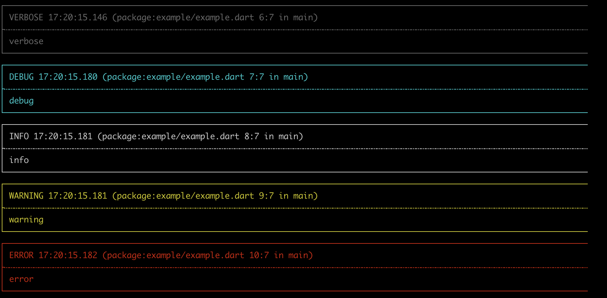
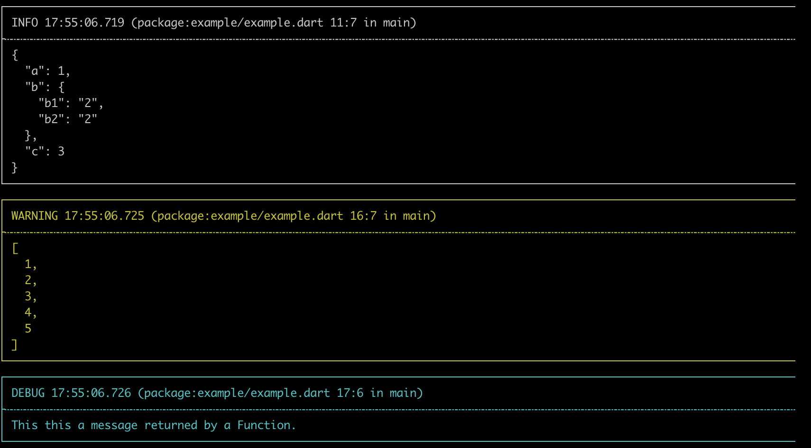
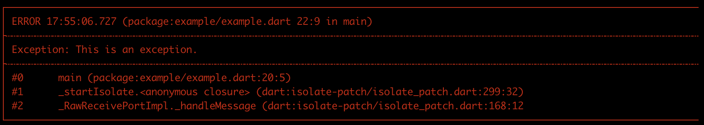
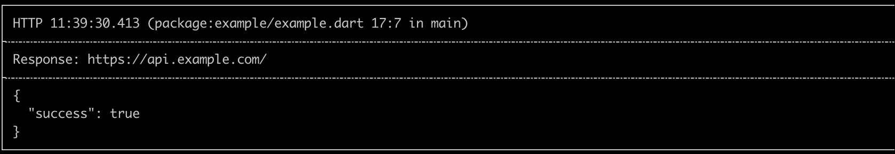
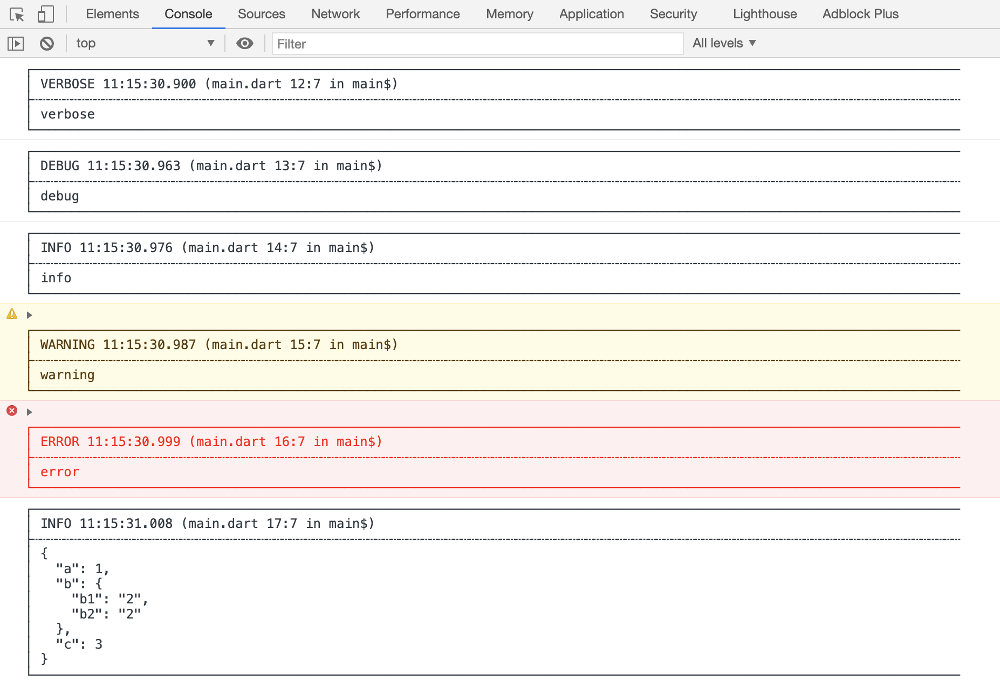

# Dog

[](https://pub.dev/packages/dog)

Simple and pretty log package for Dart, includes Flutter and web.

## Getting Started

### Install

```yaml
dependencies:
  dog: any # replace 'any' with version number.
```

```dart
import 'package:dog/dog.dart';
```

### Usage

```dart
// simple log
dog.v('verbose');
dog.d('debug');
dog.i('info');
dog.w('warning');
dog.e('error');
```


```dart
// Map.
dog.i({
  'a': 1,
  'b': {'b1': '2', 'b2': '2'},
  'c': 3
});
// Iterable.
dog.w([1, 2, 3, 4, 5]);
// Function.
dog.d(() => 'This this a message returned by Function.');
```


```dart
// Exception/StackTrace
try {
  throw Exception('This is an exception.');
} catch (e, st) {
  dog.e(e, stackTrace: st);
}
```


```dart
// tag and title support
dog.i({'success': true}, tag: 'HTTP', title: 'Response: https://api.example.com/');
```


Web platform support:



#### Dog level

See [Level](lib/src/level.dart).
```dart
// disable Dog
Dog.level = Level.OFF;
```

#### Formatter

[`PrettyFormatter`](lib/src/formatter/pretty_formatter.dart): Convert message to pretty styles.

[`SimpleFormatter`](lib/src/formatter/simple_formatter.dart): Format message without borders.

#### Emitter

[`ConsoleEmitter`](lib/src/emitter/console_formatter.dart): Output message to console.

[`FileEmitter`](lib/src/emitter/file_formatter.dart): Output message to file, it doesn't support web platform.

## Thanks

[logger](https://github.com/orhanobut/logger): Logger for android.
